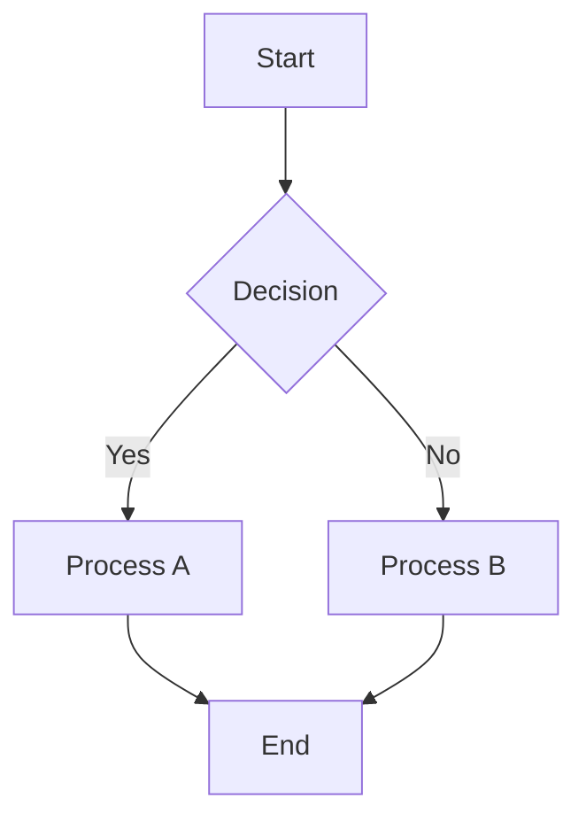

# Jekyll Facebook Template

A modern, responsive Jekyll static site generator template inspired by Facebook's clean UI/UX design. Perfect for blogs, documentation sites, and personal websites.

## ✨ Features

- **Jekyll 3.10 Compatible** - Works seamlessly with Jekyll 3.10+
- **Facebook-Inspired Design** - Clean, card-based layout with familiar social media styling
- **Enhanced Markdown Support**:
  - LaTeX/TeX mathematical expressions with MathJax
  - Mermaid diagrams for flowcharts and visualizations
  - Extended markdown features
- **Fully Responsive** - Mobile-first design that works on all screen sizes
- **Dark/Light Mode Toggle** - Persistent theme switching
- **Social Features** - Like, comment, and share functionality
- **Fast & Lightweight** - Optimized for performance
- **SEO Friendly** - Built-in SEO optimization with jekyll-seo-tag

## 🚀 Quick Start

### Prerequisites

- Ruby 2.7+ 
- Jekyll 3.10+
- Bundler

### Installation

1. **Clone or download** this template
2. **Install dependencies**:
   ```bash
   bundle install
   ```
3. **Serve locally**:
   ```bash
   bundle exec jekyll serve
   ```
4. **Open your browser** to `http://localhost:4000`

### Creating Content

1. **Add new posts** to the `_posts` directory with the format: `YYYY-MM-DD-title.markdown`
2. **Customize site settings** in `_config.yml`
3. **Modify styling** in `assets/css/style.scss`
4. **Add your images** to `assets/images/`

## 📝 Writing Content

### Basic Post Structure

```markdown
---
layout: post
title: "Your Post Title"
subtitle: "Optional subtitle"
date: 2024-01-15 14:30:00 +0000
categories: [category1, category2]
tags: [tag1, tag2, tag3]
author: "Your Name"
---

Your content goes here...
```

### Mathematics with LaTeX

Write inline math: `$E = mc^2$` → $E = mc^2$

Display equations:
```markdown
$$
\int_{-\infty}^{\infty} e^{-x^2} dx = \sqrt{\pi}
$$
```

### Mermaid Diagrams

```markdown

```

## 🎨 Customization

### Colors and Theme

Edit the CSS variables in `assets/css/style.scss`:

```scss
:root {
  --bg-primary: #ffffff;
  --bg-secondary: #f0f2f5;
  --text-primary: #1c1e21;
  --accent-primary: #1877f2;
  // ... more variables
}

.theme-dark {
  --bg-primary: #18191a;
  --bg-secondary: #242526;
  --text-primary: #e4e6ea;
  // ... dark theme overrides
}
```

### Site Configuration

Update `_config.yml` with your site details:

```yaml
title: Your Site Name
email: your-email@example.com
description: Your site description
baseurl: ""
url: "https://yourdomain.com"
twitter_username: yourusername
github_username: yourusername
```

## 📱 Responsive Breakpoints

- **Small screens**: < 768px (Mobile)
- **Medium screens**: 768px - 1024px (Tablet)
- **Large screens**: > 1024px (Desktop)

## 🔧 File Structure

```
├── _config.yml          # Jekyll configuration
├── _includes/           # Reusable template parts
│   ├── head.html
│   ├── header.html
│   └── footer.html
├── _layouts/            # Page layouts
│   ├── default.html
│   ├── post.html
│   └── page.html
├── _posts/              # Blog posts
├── _sass/               # Sass partials (if needed)
├── assets/
│   ├── css/
│   │   └── style.scss   # Main stylesheet
│   └── images/          # Site images
├── about.md             # About page
├── archive.md           # Post archive
└── index.html           # Homepage
```

## 🚀 Deployment

### GitHub Pages

1. Push your code to a GitHub repository
2. Go to Settings → Pages
3. Select source branch (usually `main` or `gh-pages`)
4. Your site will be available at `https://yourusername.github.io/repository-name`

### Netlify

1. Connect your GitHub repository to Netlify
2. Set build command: `bundle exec jekyll build`
3. Set publish directory: `_site`
4. Deploy!

### Other Platforms

The template works with any static site hosting platform:
- Vercel
- AWS S3 + CloudFront
- Digital Ocean
- Firebase Hosting

## 📚 Documentation

- [Jekyll Documentation](https://jekyllrb.com/docs/)
- [MathJax Documentation](https://docs.mathjax.org/)
- [Mermaid Documentation](https://mermaid-js.github.io/mermaid/)

## 🤝 Contributing

1. Fork the repository
2. Create a feature branch: `git checkout -b feature-name`
3. Make your changes
4. Commit: `git commit -am 'Add some feature'`
5. Push: `git push origin feature-name`
6. Submit a pull request

## 📄 License

This template is available as open source under the terms of the [MIT License](LICENSE).

## 🙏 Acknowledgments

- Inspired by Facebook's design system
- Built with [Jekyll](https://jekyllrb.com/)
- Mathematical rendering by [MathJax](https://www.mathjax.org/)
- Diagrams powered by [Mermaid](https://mermaid-js.github.io/mermaid/)
- Icons and typography from modern web standards

---

**Questions or issues?** Please open an issue on GitHub or reach out to the maintainers.

**Love the template?** Give it a ⭐ on GitHub!