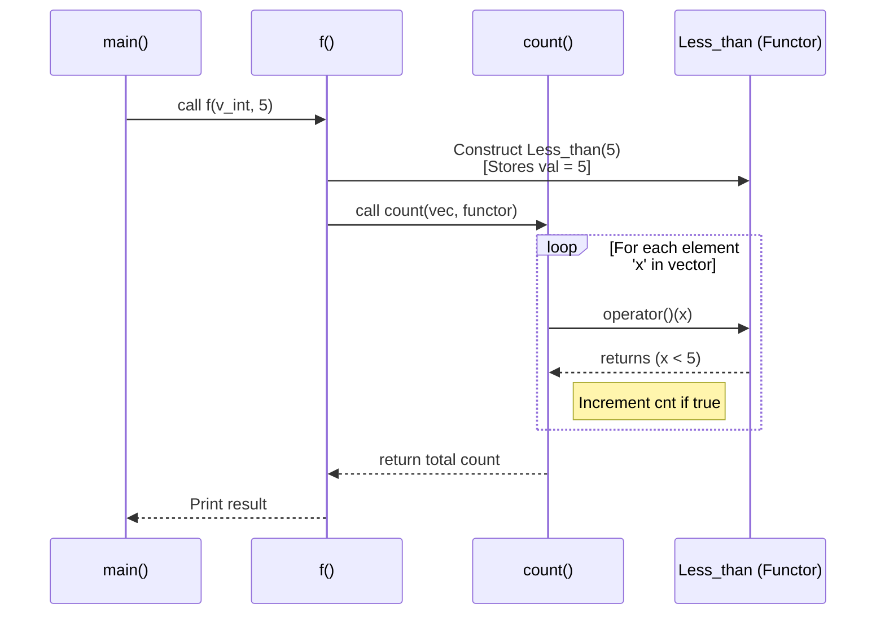

### What is Function Object

- Function object (functor) in C++ is an object (an instance of class) that can be called like a function.
    - This is achieved by writing `operator()` function of the object’s class
- Such function could be widely used as arguments in algorithms to achieve simplicity and flexibility of the data type

Following example provides a logic to count the occurences of a certain value of a certain data type (`int` in the example) by using `Less_than` class that act as a functor. Some functions like `randomInt()` and `printAll()` are helpers to make the example works in an interesting way.

```cpp
// Function Object (functor)
#include <iostream>
#include <vector>
#include <random>
#include <string>

template<typename T>
class Less_than {
    T val;

public:
    explicit Less_than(const T &v) : val(v) {}
    bool operator()(const T &x) const { return x<val; }
};

int randomInt(const int& min, const int& max) {
    static std::random_device rd;
    static std::mt19937 gen(rd());
    std::uniform_int_distribution<> distr(min, max);

    return distr(gen);
}

void askUser(int& val, const std::string& txt) {
    std::cout << txt;
    std::cin >> val;
    std::cout << std::endl;
}

template<typename C, typename P>
int count(const C& c, P predicate) {
    int count = 0;
    for (auto& x: c)
        if (predicate(x)) count++;
    return count;
}

void f(const std::vector<int>& vec, const int& x) {
    std::cout << "Number of element less than: "
              << " : " << count(vec, Less_than<int>{x})
              << std::endl;
}

void printAll(const std::vector<int>& x) {
    for (auto& element : x)
        std::cout << element << " ";
    std::cout << std::endl;
}

int main() {
    int sz, x, bound_min, bound_max;
    askUser(sz, "Size of the vector: ");
    askUser(x, "Less than: ");
    askUser(bound_min, "Minimum value: ");
    askUser(bound_max, "Max value: ");

    std::vector<int> vec_int(sz);
    for (auto& element: vec_int)
        element = randomInt(bound_min, bound_max);
    
    printAll(vec_int);
    f(vec_int, x);

    return 0;
}
```

### Sequence Diagram

